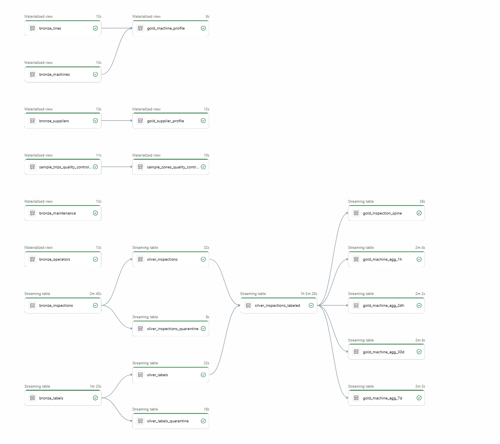
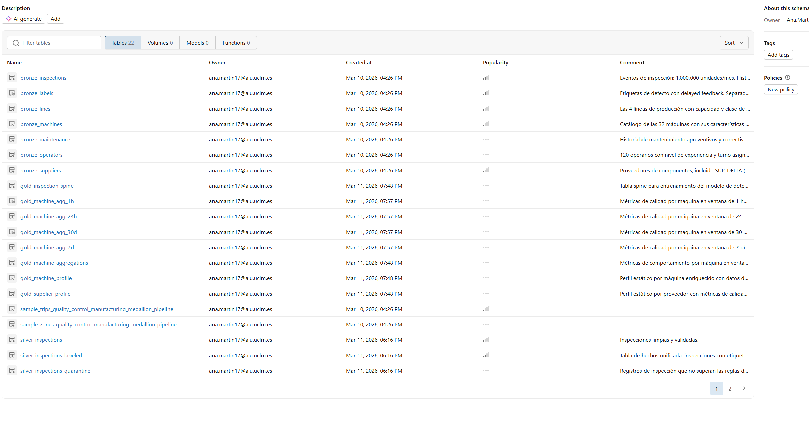

<style>
  @page {
    size: A4;
    margin: 1.5cm;
}

body {
    font-family: "Times New Roman", Times, serif;
    font-size: 11pt;
    line-height: 1.5;
    text-align: justify;
}

h1, h2, h3 {
    font-family: "Times New Roman", Times, serif;
    font-weight: bold;
    color: #1a1a1a;
}

h1 { font-size: 20pt; margin-bottom: 0.5em; }
h2 { font-size: 16pt; margin-top: 1em; margin-bottom: 0.4em; }
h3 { font-size: 14pt; margin-top: 0.8em; margin-bottom: 0.3em; }

table {
    width: 100%;
    border-collapse: collapse;
    margin-top: 1em;
    margin-bottom: 1em;
}

table, th, td {
    border: 1px solid #999;
}

th, td {
    padding: 6px 10px;
    text-align: center;
    font-size: 11pt;
}

th {
    background-color: #f2f2f2;
}

div.portada {
    text-align: center;
    margin-top: 150px;
}

div.portada h1 {
    font-size: 22pt;
}

div.portada p {
    font-size: 12pt;
    margin: 0.4em 0;
}

.page-break {
    page-break-after: always;
}
</style>

<div class="portada">
 

**Asignatura:** Desarrollo y despliegue de soluciones Big Data  
**Máster:** Big Data y Análisis de Datos  

<br>

**Estudiante:** Ana Martín Serrano  

<br>

**Fecha de entrega:** Marzo 2026

</div>

<div class="page-break"></div>


---

## 3.1. Configuración del Entorno de Trabajo y Control de Versiones

El entorno de trabajo se configuró sobre **Azure Databricks** con Unity Catalog habilitado, accediendo a la plataforma mediante una cuenta universitaria a través del programa Azure for Students. Esta elección frente a la versión Community Edition fue necesaria para disponer de las capacidades completas de gobernanza de datos que requiere el proyecto: creación de schemas personalizados, volúmenes gestionados y el orquestador Delta Live Tables.

El control de versiones del proyecto se gestiona mediante un repositorio **GitHub** vinculado directamente al workspace de Databricks a través de la integración nativa de Git. El repositorio almacena exclusivamente el código fuente (notebooks y scripts Python), mientras que los datos residen en el sistema de ficheros distribuido de la plataforma. La vinculación se realizó mediante:

```
Workspace → Create → Git Folder → URL del repositorio
```

La estructura del repositorio generada automáticamente por el orquestador DLT es la siguiente:

```
quality-control-manufacturing/
├── README.md
├── .gitignore
├── databricks.yml
├── pyproject.toml
├── resources/
└── src/
    └── quality_control_manufacturing_medallion_pipeline_etl/
        ├── explorations/
        └── transformations/
            ├── 01_bronze_ingestion.py
            ├── 02_silver_transformation.py
            ├── 03_gold_machine_aggregations.py
            ├── 03_gold_machine_profile.py
            ├── 03_gold_inspection_spine.py
            └── rules/
                ├── __init__.py
                ├── inspections.py
                └── labels.py
```

---

## 3.2. Infraestructura de Datos y Gobernanza

### 3.2.1. Jerarquía Unity Catalog

| Nivel | Nombre | Descripción |
|-------|--------|-------------|
| **Catalog** | `workspace` | Contenedor de nivel superior, unidad de gobernanza principal |
| **Schema** | `quality_control_manufacturing` | Agrupación lógica del proyecto, contiene el volumen de datos |
| **Schema** | `ana_martin17` | Schema de trabajo donde se materializan las tablas del pipeline |
| **Volume** | `landing_zone` | Punto de montaje para los archivos crudos originales |

### 3.2.2. Creación de la Landing Zone y Carga de Datos

La landing zone (`/Volumes/workspace/quality_control_manufacturing/landing_zone/`) organiza los datos crudos siguiendo la estrategia de **Hive Partitioning**, que permite al motor Spark realizar *partition pruning* y leer únicamente las particiones necesarias para cada consulta.

La estructura de directorios adoptada es la siguiente:

```
landing_zone/
├── context/                          ← Datos maestros estáticos (.csv)
│   ├── machines.csv                  (32 máquinas)
│   ├── lines.csv                     (4 líneas de producción)
│   ├── suppliers.csv                 (4 proveedores)
│   ├── operators.csv                 (120 operarios)
│   └── maintenance.csv              (576 registros de mantenimiento)
│
├── events/                           ← Eventos históricos 2023-2024 (.json)
│   ├── inspections/
│   │   ├── 2023/01/data.json
│   │   ├── 2023/02/data.json
│   │   └── ...
│   └── labels/
│       ├── 2023/01/data.json
│       └── ...
│
└── source_buffer/                    ← Datos de producción 2025 (.json)
    ├── inspections/
    │   ├── 2025/01/data.json
    │   └── ...
    └── labels/
        └── ...
```

**Justificación del particionamiento temporal:** Los datos de inspección se particionan por `year/month` porque el volumen de datos crece de forma indefinida (1.000.000 de unidades por mes). Esta estrategia permite que las consultas que filtran por rango temporal lean únicamente las carpetas relevantes, reduciendo drásticamente el volumen de datos escaneados.

**Separación events/labels:** Los eventos de inspección y sus etiquetas de defecto se almacenan en subdirectorios separados de forma deliberada. En un entorno real de manufactura, la confirmación de si una pieza es defectuosa puede tardar días o semanas (*delayed feedback*): la pieza debe superar pruebas funcionales adicionales antes de confirmar el defecto. Esta separación permite ingerir y procesar cada flujo de forma independiente.

---

## 3.3. Automatización y Orquestación

El pipeline se implementó mediante **Delta Live Tables (DLT)**, el orquestador nativo de Databricks, bajo el nombre `quality_control_manufacturing_medallion_pipeline`. DLT infiere automáticamente el grafo de dependencias (DAG) entre las tablas declaradas, gestiona los checkpoints de streaming, las transacciones y la infraestructura subyacente.

El pipeline opera en modo **Triggered** (por lotes), adecuado para el entorno académico. La gran ventaja arquitectónica de DLT es que el código de transformación está completamente desacoplado de la infraestructura: para pasar a producción en tiempo real bastaría con cambiar el modo de `Triggered` a `Continuous` en la configuración del pipeline, sin modificar ninguna línea de código Python.

---

## 3.4. Ingesta de Datos: Capa Bronce

### 3.4.1. Metodología

La capa bronce almacena una copia exacta e inmutable de los archivos originales convertidos al formato columnar **Delta Lake**. La ingesta se implementa de forma **declarativa** mediante los decoradores de `pyspark.pipelines`, diferenciando dos modos de lectura según la naturaleza de los datos:

- **Modo batch (`spark.read`):** Para datos maestros o dimensionales del directorio `context/`. Al ser datos estáticos, se realiza una lectura completa que sobrescribe los datos en cada ejecución.

- **Modo streaming (`spark.readStream` con Auto Loader):** Para los eventos de inspección y etiquetas. El Auto Loader monitoriza los directorios de forma continua y mantiene *checkpoints* que registran el último archivo procesado, garantizando eficiencia e idempotencia (sin duplicados).

### 3.4.2. Tablas de la Capa Bronce

| Tabla | Tipo | Registros | Descripción |
|-------|------|-----------|-------------|
| `bronze_machines` | Batch | 32 | Catálogo de máquinas con tipo, línea, fecha de instalación y parámetros técnicos |
| `bronze_lines` | Batch | 4 | Líneas de producción con capacidad diaria y clase de sala limpia |
| `bronze_suppliers` | Batch | 4 | Proveedores con métricas de calidad esperadas y fecha de incorporación |
| `bronze_operators` | Batch | 120 | Operarios con nivel de experiencia y turno asignado |
| `bronze_maintenance` | Batch | 576 | Historial de mantenimientos preventivos y correctivos por máquina |
| `bronze_inspections` | Streaming | 30.000.000 | Lecturas de sensores y parámetros de proceso por unidad inspeccionada |
| `bronze_labels` | Streaming | 30.000.000 | Etiquetas de defecto con fecha de disponibilidad (delayed feedback) |

**Total de registros ingestados:** 30.060.736

### 3.4.3. Metadatos de Auditoría

Todas las tablas incluyen columnas técnicas de trazabilidad generadas automáticamente:

- `ingestion_timestamp`: Instante exacto en que el dato entró al ecosistema analítico.
- `source_file`: Ruta absoluta del archivo origen de cada registro (`_metadata.file_path`).
- `_rescued_data`: Captura discrepancias de esquema sin detener la ingesta.

### 3.4.4. Esquemas de las Tablas de la Capa Bronce

A continuación se detalla exhaustivamente la información del esquema de cada una de las tablas generadas en la capa bronce. Además de las columnas específicas documentadas para cada tabla, es importante recordar que **todas** incluyen las variables técnicas de trazabilidad y auditoría descritas en la sección anterior (`ingestion_timestamp` y `source_file`). Comprender estas variables es la base para derivar después nuestras características de aprendizaje automático.

#### Esquema de la Tabla Principal: `bronze_inspections`

| Columna | Tipo | Descripción de negocio |
|---------|------|----------------------|
| `unit_id` | STRING | Identificador único de la unidad inspeccionada |
| `timestamp` | STRING | Instante temporal de la inspección |
| `machine_id` | STRING | Máquina que fabricó la unidad |
| `line_id` | STRING | Línea de producción (LINE_A a LINE_D) |
| `shift` | STRING | Turno de trabajo (morning/afternoon/night) |
| `supplier_id` | STRING | Proveedor del material de la unidad |
| `material_batch_id` | STRING | Lote de material de origen |
| `temperature_celsius` | DOUBLE | Temperatura del horno/reflujo en °C |
| `pressure_bar` | DOUBLE | Presión hidráulica en bar |
| `vibration_mm_s` | DOUBLE | Vibración del transportador en mm/s |
| `voltage_v` | DOUBLE | Voltaje de alimentación del componente en V |
| `current_ma` | DOUBLE | Corriente operativa en mA |
| `humidity_pct` | DOUBLE | Humedad ambiente en sala limpia (%) |
| `particle_count_m3` | LONG | Partículas en suspensión por m³ |
| `solder_thickness_um` | DOUBLE | Grosor del punto de soldadura en µm |
| `alignment_error_um` | DOUBLE | Error de posicionamiento del componente en µm |
| `optical_density` | DOUBLE | Puntuación de inspección óptica |
| `tool_wear_pct` | DOUBLE | Desgaste de la herramienta (0-100%) |
| `time_since_maintenance_h` | DOUBLE | Horas desde el último mantenimiento preventivo |
| `production_speed_pct` | DOUBLE | Velocidad de línea como % de la nominal |
| `operator_experience_yrs` | DOUBLE | Años de experiencia del operario |
| `cycle_time_s` | DOUBLE | Tiempo de ciclo real en segundos |

#### Esquema de `bronze_labels`

| Columna | Tipo | Descripción de negocio |
|---------|------|----------------------|
| `unit_id` | STRING | Identificador de la unidad productiva |
| `is_defective` | INTEGER | Variable binaria objetivo (0 = Válida, 1 = Defectuosa) |
| `label_available_date` | TIMESTAMP | Instante en que la etiqueta se hace verdaderamente disponible (delayed feedback) |

#### Esquemas Estáticos de Contexto

**1. `bronze_machines`**
| Columna | Tipo | Descripción de negocio |
|---------|------|----------------------|
| `machine_id` | STRING | Identificador único de la máquina (ej: MAC_01) |
| `machine_type` | STRING | Clasificación y modelo de la maquinaria utilizada |
| `line_id` | STRING | Línea de producción a la cual ha sido asignada físicamente |
| `installation_date` | DATE | Fecha de puesta en marcha inicial en la planta |
| `vibration_baseline_mm_s`| DOUBLE | Umbral nominal de vibración esperada para uso como límite o benchmark |

**2. `bronze_lines`**
| Columna | Tipo | Descripción de negocio |
|---------|------|----------------------|
| `line_id` | STRING | Identificador de la línea (LINE_A a LINE_D) |
| `daily_capacity` | INTEGER | Meta técnica de capacidad productiva por día |
| `clean_room_class` | STRING | Clase o nivel de certificación de sala limpia (ej: Class 100) |

**3. `bronze_suppliers`**
| Columna | Tipo | Descripción de negocio |
|---------|------|----------------------|
| `supplier_id` | STRING | Código único del proveedor de materiales (ej. SUP_ALPHA) |
| `start_date` | DATE | Fecha en que el proveedor comenzó a proveer recursos |
| `expected_quality` | DOUBLE | Ratio promedio o métrica estándar esperada a nivel histórico |
| `solder_thickness_mean_um` | DOUBLE | Referencia técnica de grosor aportada según especificación de materiales |

**4. `bronze_operators`**
| Columna | Tipo | Descripción de negocio |
|---------|------|----------------------|
| `operator_id` | STRING | Código único identificador de empleado operario |
| `experience_level` | STRING | Nivel de destreza profesional según antigüedad (ej. Jr, SSR, Sr) |
| `shift` | STRING | Turno administrativo formal que se le ha fijado |

**5. `bronze_maintenance`**
| Columna | Tipo | Descripción de negocio |
|---------|------|----------------------|
| `maintenance_id` | STRING | Identificador del evento de reparación o calibración |
| `machine_id` | STRING | Máquina a la cual se le aplicó el soporte |
| `maintenance_date` | TIMESTAMP | Fecha y hora en que se consumó la intervención |
| `maintenance_type` | STRING | Tipología de mantenimiento operativo (preventivo vs correctivo) |

---

## 3.5. Refinamiento y Calidad de Datos: Capa Plata

### 3.5.1. Reglas de Calidad (Expectations)

Las reglas de calidad se implementan de forma modular en el directorio `rules/`, con un fichero por dominio lógico. Cada regla consta de un nombre, una restricción en sintaxis SQL y un tag de clasificación.

#### Reglas para `bronze_inspections`

| Regla | Restricción SQL | Justificación |
|-------|----------------|---------------|
| `unit_id_not_null` | `unit_id IS NOT NULL` | Clave primaria obligatoria para el join con etiquetas |
| `temperature_valid` | `temperature_celsius BETWEEN 150 AND 300` | Rango operativo del horno de reflujo; valores fuera indican fallo del sensor |
| `pressure_valid` | `pressure_bar BETWEEN 0.5 AND 10.0` | Rango de presión hidráulica normal; extremos indican fallo mecánico |
| `vibration_valid` | `vibration_mm_s BETWEEN 0.0 AND 15.0` | Valores superiores a 15 mm/s indican deterioro estructural severo |
| `voltage_valid` | `voltage_v BETWEEN 2.5 AND 4.5` | Voltaje de lógica digital de componentes electrónicos (3.3V nominal) |
| `humidity_valid` | `humidity_pct BETWEEN 20.0 AND 80.0` | Rango admisible en sala limpia; fuera puede causar corrosión o descarga estática |
| `solder_thickness_valid` | `solder_thickness_um BETWEEN 50 AND 250` | Rango de grosor de soldadura funcional |
| `alignment_error_valid` | `alignment_error_um BETWEEN 0 AND 100` | Errores superiores a 100µm causan fallos de contacto eléctrico |
| `machine_id_not_null` | `machine_id IS NOT NULL` | Clave de trazabilidad para análisis de degradación por máquina |
| `line_id_valid` | `line_id IN ('LINE_A','LINE_B','LINE_C','LINE_D')` | Solo existen 4 líneas de producción en la planta |
| `shift_valid` | `shift IN ('morning','afternoon','night')` | Solo existen 3 turnos definidos |
| `tool_wear_valid` | `tool_wear_pct BETWEEN 0 AND 100` | Porcentaje acotado por definición |
| `production_speed_valid` | `production_speed_pct BETWEEN 50 AND 130` | Velocidades fuera de este rango son operativamente imposibles |
| `timestamp_not_null` | `timestamp IS NOT NULL` | Obligatorio para el particionamiento temporal y el watermark de streaming |

#### Reglas para `bronze_labels`

| Regla | Restricción SQL | Justificación |
|-------|----------------|---------------|
| `unit_id_not_null` | `unit_id IS NOT NULL` | Clave de join con la tabla de inspecciones |
| `is_defective_valid` | `is_defective IN (0, 1)` | Variable binaria; valores distintos de 0 o 1 son corrupción de datos |
| `label_available_date_not_null` | `label_available_date IS NOT NULL` | Necesario para el watermark del join stream-stream |

### 3.5.2. Proceso de Cuarentena (Dead Letter Queue)

Se implementó una arquitectura de **cuarentena** para gestionar los registros inválidos sin detener el pipeline ni perder datos de forma irrecuperable. El flujo es el siguiente:

1. Se evalúan todas las reglas sobre los datos bronces.
2. Los registros que incumplen alguna regla se derivan a las tablas de cuarentena (`silver_inspections_quarantine`, `silver_labels_quarantine`).
3. Los registros válidos fluyen a las tablas limpias de plata.

Durante el desarrollo se detectó un error inicial en la regla `voltage_valid`: el rango original (200-260V) correspondía al voltaje de red eléctrica, pero los datos reales contienen el voltaje de alimentación de los componentes electrónicos (~3.3V, rango 2.5-4.5V). Tras corregir la regla, el resultado fue:

| Tabla | Registros | Interpretación |
|-------|-----------|---------------|
| `silver_inspections` | 30.000.000 | 100% de registros válidos tras corrección |
| `silver_inspections_quarantine` | 0 | Sin anomalías tras ajuste de reglas |
| `silver_labels` | 30.000.000 | 100% de etiquetas válidas |
| `silver_labels_quarantine` | 0 | Sin etiquetas anómalas |

La ausencia de registros en cuarentena es coherente con la naturaleza sintética del dataset, generado con distribuciones controladas dentro de rangos físicamente plausibles.

### 3.5.3. Tabla de Hechos Unificada

La tabla `silver_inspections_labeled` une los flujos de inspecciones y etiquetas mediante un **stream-stream join con watermark de 30 días**. Este umbral se estimó a partir del diseño del dataset, donde el delayed feedback puede alcanzar hasta 30 días. El join se implementa como LEFT JOIN para conservar todas las inspecciones aunque la etiqueta no haya llegado aún.

| Tabla | Registros |
|-------|-----------|
| `silver_inspections_labeled` | 30.000.032 |

Los 32 registros adicionales respecto a las inspecciones corresponden a unidades del `source_buffer` (2025) que tienen etiqueta disponible en los datos históricos.

---

## 3.6. Preparación para Aprendizaje Automático: Capa Oro

### 3.6.1. Agregaciones Dinámicas de Comportamiento: `gold_machine_agg_*`

Se generaron cuatro tablas de agregaciones temporales por máquina, cada una con una ventana diferente:

| Tabla | Ventana | Registros | Propósito |
|-------|---------|-----------|-----------|
| `gold_machine_agg_1h` | 1 hora | 677.344 | Detección de anomalías en tiempo real |
| `gold_machine_agg_24h` | 24 horas | 28.192 | Tendencia diaria de calidad |
| `gold_machine_agg_7d` | 7 días | 4.032 | Tendencia semanal, detección de degradación |
| `gold_machine_agg_30d` | 30 días | 928 | Baseline mensual de referencia |

Cada tabla contiene las siguientes métricas por máquina y ventana temporal:

- `total_units` / `defects` / `defect_rate`: Volumen de producción y tasa de defectos.
- `avg_vibration`: Media de vibración. Un aumento progresivo indica degradación mecánica.
- `avg_tool_wear`: Desgaste medio de herramienta. Anticipa necesidades de mantenimiento.
- `avg_temperature`: Temperatura media del proceso. Desvíos indican problemas de horno.
- `avg_solder_thickness`: Grosor medio de soldadura. Cambios correlacionan con cambios de proveedor.
- `avg_alignment_error`: Error medio de posicionamiento. Indica precisión de la máquina.

**Valor predictivo:** La comparación entre la tasa de defectos en la ventana de 1 hora y el baseline de 30 días permite detectar degradación progresiva de máquinas antes de que genere un volumen significativo de defectos. Esta señal es especialmente relevante para modelar el *data drift* y *concept drift* introducidos en 2025 (degradación de máquinas y nuevo proveedor).

### 3.6.2. Perfiles Estáticos: `gold_machine_profile` y `gold_supplier_profile`

| Tabla | Registros | Descripción |
|-------|-----------|-------------|
| `gold_machine_profile` | 32 | Perfil enriquecido de cada máquina con antigüedad, tipo y clase de sala limpia |
| `gold_supplier_profile` | 4 | Perfil de cada proveedor con calidad histórica y flag de proveedor nuevo |

Estas tablas están diseñadas para ser consumidas por el **Feature Store** de Databricks, habilitando `delta.enableChangeDataFeed` para sincronización incremental. Las características estáticas más relevantes para el modelo son:

- `machine_age_days`: Las máquinas más antiguas tienen mayor probabilidad de defectos.
- `vibration_baseline_mm_s`: Permite detectar desviaciones respecto al comportamiento nominal.
- `is_new_supplier`: Flag binario que señala el riesgo asociado a SUP_DELTA (nuevo desde 2025-03).
- `solder_thickness_mean_um`: El grosor esperado del proveedor como referencia para detectar anomalías.

### 3.6.3. Tabla Spine: `gold_inspection_spine`

| Tabla | Registros | Descripción |
|-------|-----------|-------------|
| `gold_inspection_spine` | 30.000.032 | Tabla base para entrenamiento e inferencia del modelo ML |

La tabla spine contiene exclusivamente los identificadores primarios (`unit_id`), el timestamp del evento, la variable objetivo (`is_defective`) y las features disponibles en el momento de la inspección en tiempo real. No incluye perfiles ni agregaciones — estos se inyectarán automáticamente por el Feature Store durante el entrenamiento, garantizando *point-in-time correctness* y evitando la fuga de datos del futuro.

**Variable objetivo:** `is_defective` (binaria: 0 = válida, 1 = defectuosa). Tasa de positivos ~2% en datos históricos, con incremento progresivo en 2025 debido al drift.

---

## 3.7. Modos de Ejecución del Pipeline e Infraestructura

El pipeline opera en modo **Triggered** (por lotes), ejecutándose bajo demanda. Esta configuración es adecuada para el entorno académico, donde el control de costes es prioritario. La arquitectura DLT desacopla completamente la lógica de transformación de la infraestructura: para desplegar el sistema en producción en tiempo real bastaría con cambiar el `Pipeline mode` de `Triggered` a `Continuous` en la configuración del pipeline, sin modificar ninguna línea del código Python.

### Justificación de las Características para el Modelo ML

Las características creadas en la capa oro se pueden clasificar en tres grupos según su naturaleza:

**Características de sensor en tiempo real** (disponibles en inferencia instantánea):
`vibration_mm_s`, `solder_thickness_um`, `alignment_error_um`, `optical_density`, `tool_wear_pct`. Estas variables tienen correlación directa con el defecto según el diseño del dataset y son las más importantes para el modelo. El *concept drift* de 2025 afecta especialmente a `vibration_mm_s` (los umbrales seguros ya no son válidos) y `solder_thickness_um` (el proveedor nuevo tiene distribuciones distintas).

**Características de proceso** (contexto de la producción):
`shift`, `operator_experience_yrs`, `time_since_maintenance_h`, `production_speed_pct`. Capturan el contexto humano y organizativo de la producción. El turno nocturno tiene mayor riesgo de defecto; operarios con menos experiencia y máquinas con muchas horas desde el último mantenimiento también aumentan la probabilidad.

**Características de identidad** (para unirse con el Feature Store):
`machine_id`, `supplier_id`, `line_id`. Permiten al Feature Store inyectar el perfil histórico de la máquina y del proveedor en el momento exacto de la inspección, aportando información sobre antigüedad, degradación acumulada y calidad histórica del proveedor.

La combinación de estas tres familias de características permite al modelo aprender tanto los patrones instantáneos (lecturas de sensor anómalas) como los patrones contextuales (máquinas degradadas, proveedores de baja calidad, turnos de riesgo), lo que es esencial para mantener rendimiento predictivo ante el *concept drift* progresivo introducido en los datos de 2025.

---

## 3.8. Resumen de la Arquitectura

El DAG completo del pipeline materializa las siguientes capas:

```
BRONCE (7 tablas)          PLATA (5 tablas)           ORO (7 tablas)
──────────────────         ──────────────────         ──────────────
bronze_machines    ──┐     silver_inspections          gold_machine_profile
bronze_lines       ──┤──►  silver_inspections_q        gold_supplier_profile
bronze_suppliers   ──┘     silver_labels               gold_machine_agg_1h
bronze_operators           silver_labels_q             gold_machine_agg_24h
bronze_maintenance         silver_inspections_labeled  gold_machine_agg_7d
bronze_inspections ──────► (join stream-stream) ────►  gold_machine_agg_30d
bronze_labels      ──────►                             gold_inspection_spine
```

**Total de registros gestionados:** ~90 millones entre todas las capas.  
**Período temporal cubierto:** Enero 2023 – Junio 2025 (30 meses).  
**Volumen de datos en landing zone:** ~19.9 GB.

---

## Tabla resumen de capas del pipeline

| Capa   | Tablas principales                                      |
|--------|---------------------------------------------------------|
| Bronce | bronze_machines, bronze_lines, bronze_suppliers, bronze_operators, bronze_maintenance, bronze_inspections, bronze_labels |
| Plata  | silver_inspections, silver_inspections_quarantine, silver_labels, silver_labels_quarantine, silver_inspections_labeled |
| Oro    | gold_machine_profile, gold_supplier_profile, gold_machine_agg_1h, gold_machine_agg_24h, gold_machine_agg_7d, gold_machine_agg_30d, gold_inspection_spine |


## Estructura del pipeline (en vez de diagrama ASCII)

- **Bronce:**
  - bronze_machines
  - bronze_lines
  - bronze_suppliers
  - bronze_operators
  - bronze_maintenance
  - bronze_inspections
  - bronze_labels
- **Plata:**
  - silver_inspections
  - silver_inspections_quarantine
  - silver_labels
  - silver_labels_quarantine
  - silver_inspections_labeled (join stream-stream)
- **Oro:**
  - gold_machine_profile
  - gold_supplier_profile
  - gold_machine_agg_1h
  - gold_machine_agg_24h
  - gold_machine_agg_7d
  - gold_machine_agg_30d
  - gold_inspection_spine


---

## Ejemplo visual del DAG del pipeline en Databricks



## Vista del catálogo de tablas en Unity Catalog



---

> Enlaces: [DataBricks URL](https://dbc-b6d08693-29d5.cloud.databricks.com/browse/folders/536399241519399?o=7474647125702341)

> [Repositorio Github](https://github.com/anams01/quality_control_manufacturing_medallion_pipeline.git)
